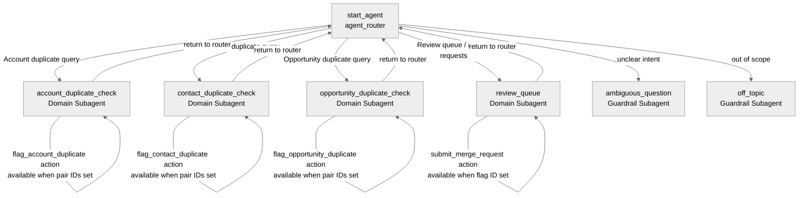

# Agent Spec: Duplicate_Flagging_Agent

## Purpose & Scope

An internal employee assistant that helps Salesforce users (Sales Ops, RevOps, Data Admins) proactively identify and flag duplicate records across Accounts, Contacts, and Opportunities. The agent presents confidence-scored duplicate matches and allows employees to flag pairs for admin review and merge request submission — all without performing any automatic merges or deletes.

## Behavioral Intent

- Respects Salesforce Role Hierarchy and FLS — all backing Apex queries run in USER_MODE so employees only see records they have access to.
- Read + flag only: the agent can search, present duplicates, update duplicate-flag metadata, and log merge requests. It cannot merge or hard-delete records.
- Confidence scores are returned as human-readable percentage strings (e.g., `"88%"`) from Apex to avoid numeric type constraints in action I/O.
- Flagging actions are gated behind user confirmation of record IDs to prevent accidental flags.
- Three object domains (Accounts, Contacts, Opportunities) are handled by dedicated domain subagents to keep instructions focused.

## Subagent Map

All domain subagents use handoff transitions back to `agent_router`. No delegation (call-return) patterns are needed.

## Variables

- `account_id_1` (mutable string = "") — First Account ID in a suspected duplicate pair. Set by user confirmation after `find_duplicate_accounts` results. Read by `flag_account_duplicate` gate.
- `account_id_2` (mutable string = "") — Second Account ID in the suspected pair. Same lifecycle as `account_id_1`.
- `contact_id_1` (mutable string = "") — First Contact ID in a suspected duplicate pair.
- `contact_id_2` (mutable string = "") — Second Contact ID in the suspected pair.
- `opportunity_id_1` (mutable string = "") — First Opportunity ID in a suspected duplicate pair.
- `opportunity_id_2` (mutable string = "") — Second Opportunity ID in the suspected pair.
- `selected_flag_id` (mutable string = "") — ID of an existing duplicate-flag record selected for merge request submission. Set after user selects from review queue. Read by `submit_merge_request` gate.

## Actions & Backing Logic

---

### find_duplicate_accounts (account_duplicate_check subagent)

- **Target:** `apex://DuplicateAccountFinder`
- **Backing Status:** NEEDS STUB

#### Inputs

| Name | Type | Required | Source |
|------|------|----------|--------|
| searchName | string | No | User conversation — account name to search |
| searchWebsite | string | No | User conversation — website to match |
| searchTaxId | string | No | User conversation — Tax ID to match |

#### Outputs

| Name | Type | Visible to User? | Notes |
|------|------|-----------------|-------|
| matches | list[object] | Yes | List of duplicate matches with confidence scores |
| hasResults | boolean | No | Internal gate flag |

- `matches` complex_data_type_name: `@apexClassType/c__DuplicateAccountFinder$DuplicateMatch`
- `DuplicateMatch` inner class fields: `recordId` (String), `recordName` (String), `website` (String), `confidenceScore` (String), `matchReason` (String)

#### Stubbing Requirement

Functional Apex with SOQL. Query `Account` records where `Name`, `Website`, or `Custom Tax ID field` match the input using `LIKE` or `=`. Return top 10 matches ranked by confidence. Run `WITH USER_MODE` via `Database.query(q, AccessLevel.USER_MODE)`. Stub can return 2 hardcoded `DuplicateMatch` records with `confidenceScore = '88%'`.

---

### flag_account_duplicate (account_duplicate_check subagent)

- **Target:** `apex://DuplicateFlagCreator`
- **Backing Status:** NEEDS STUB

#### Inputs

| Name | Type | Required | Source |
|------|------|----------|--------|
| recordId1 | string | Yes | `@variables.account_id_1` |
| recordId2 | string | Yes | `@variables.account_id_2` |
| objectType | string | Yes | Hardcoded `"Account"` in binding |
| notes | string | No | User conversation |

#### Outputs

| Name | Type | Visible to User? | Notes |
|------|------|-----------------|-------|
| flagId | string | No | Created flag record ID for downstream use |
| confirmationMessage | string | Yes | Human-readable confirmation of flag creation |
| success | boolean | No | Internal success gate |

#### Stubbing Requirement

Minimal stub. Creates a custom `DuplicateFlag__c` record (or equivalent) with `RecordId1__c`, `RecordId2__c`, `ObjectType__c`, `Notes__c`, `Status__c = 'Pending Review'`. Returns a hardcoded `confirmationMessage = 'Duplicate flagged for admin review.'` in stub.

**Note:** `DuplicateFlagCreator` backs all three `flag_*_duplicate` actions — same class, `objectType` input discriminates the SObject type. One Apex class covers all three.

---

### find_duplicate_contacts (contact_duplicate_check subagent)

- **Target:** `apex://DuplicateContactFinder`
- **Backing Status:** NEEDS STUB

#### Inputs

| Name | Type | Required | Source |
|------|------|----------|--------|
| searchEmail | string | No | User conversation |
| searchPhone | string | No | User conversation |
| searchName | string | No | User conversation |

#### Outputs

| Name | Type | Visible to User? | Notes |
|------|------|-----------------|-------|
| matches | list[object] | Yes | List of duplicate Contact matches |
| hasResults | boolean | No | Internal gate flag |

- `matches` complex_data_type_name: `@apexClassType/c__DuplicateContactFinder$DuplicateMatch`
- `DuplicateMatch` fields: `recordId` (String), `fullName` (String), `email` (String), `phone` (String), `accountName` (String), `confidenceScore` (String), `matchReason` (String)

#### Stubbing Requirement

Functional Apex. Query `Contact` where `Email = :searchEmail OR Phone = :searchPhone OR Name LIKE :('%' + searchName + '%')`. Run with `AccessLevel.USER_MODE`. Return top 10. Stub returns 2 hardcoded matches.

---

### flag_contact_duplicate (contact_duplicate_check subagent)

- **Target:** `apex://DuplicateFlagCreator`
- **Backing Status:** NEEDS STUB (same class as `flag_account_duplicate` above — already counted)

#### Inputs

| Name | Type | Required | Source |
|------|------|----------|--------|
| recordId1 | string | Yes | `@variables.contact_id_1` |
| recordId2 | string | Yes | `@variables.contact_id_2` |
| objectType | string | Yes | Hardcoded `"Contact"` |
| notes | string | No | User conversation |

#### Outputs

Same as `flag_account_duplicate` outputs.

---

### find_duplicate_opportunities (opportunity_duplicate_check subagent)

- **Target:** `apex://DuplicateOpportunityFinder`
- **Backing Status:** NEEDS STUB

#### Inputs

| Name | Type | Required | Source |
|------|------|----------|--------|
| searchExternalId | string | No | User conversation |
| searchAccountName | string | No | User conversation |
| searchCloseDate | string | No | User conversation (as string, e.g. "Q1 2025") |

#### Outputs

| Name | Type | Visible to User? | Notes |
|------|------|-----------------|-------|
| matches | list[object] | Yes | List of duplicate Opportunity matches |
| hasResults | boolean | No | Internal gate flag |

- `matches` complex_data_type_name: `@apexClassType/c__DuplicateOpportunityFinder$DuplicateMatch`
- `DuplicateMatch` fields: `recordId` (String), `opportunityName` (String), `accountName` (String), `amount` (String), `closeDate` (String), `confidenceScore` (String), `matchReason` (String)

#### Stubbing Requirement

Functional Apex. Query `Opportunity` matching `External_Id__c`, `Account.Name LIKE`, or `CloseDate` range. Use `AccessLevel.USER_MODE`. Return top 10. Stub returns 2 hardcoded matches.

---

### flag_opportunity_duplicate (opportunity_duplicate_check subagent)

- **Target:** `apex://DuplicateFlagCreator`
- **Backing Status:** NEEDS STUB (same shared class)

#### Inputs

| Name | Type | Required | Source |
|------|------|----------|--------|
| recordId1 | string | Yes | `@variables.opportunity_id_1` |
| recordId2 | string | Yes | `@variables.opportunity_id_2` |
| objectType | string | Yes | Hardcoded `"Opportunity"` |
| notes | string | No | User conversation |

#### Outputs

Same as `flag_account_duplicate` outputs.

---

### get_duplicate_review_queue (review_queue subagent)

- **Target:** `apex://DuplicateReviewQueueFetcher`
- **Backing Status:** NEEDS STUB

#### Inputs

| Name | Type | Required | Source |
|------|------|----------|--------|
| objectTypeFilter | string | No | User conversation (e.g. "Account", "Contact", or blank for all) |

#### Outputs

| Name | Type | Visible to User? | Notes |
|------|------|-----------------|-------|
| flaggedPairs | list[object] | Yes | Pending duplicate flag records for review |
| hasResults | boolean | No | Internal gate flag |

- `flaggedPairs` complex_data_type_name: `@apexClassType/c__DuplicateReviewQueueFetcher$FlaggedPair`
- `FlaggedPair` fields: `flagId` (String), `objectType` (String), `recordName1` (String), `recordName2` (String), `confidenceScore` (String), `status` (String), `createdDate` (String)

#### Stubbing Requirement

Functional Apex. Query `DuplicateFlag__c` records with `Status__c = 'Pending Review'`, optionally filtered by `ObjectType__c`. Run with `AccessLevel.USER_MODE`. Stub returns 2 hardcoded `FlaggedPair` records.

---

### submit_merge_request (review_queue subagent)

- **Target:** `apex://MergeRequestSubmitter`
- **Backing Status:** NEEDS STUB

#### Inputs

| Name | Type | Required | Source |
|------|------|----------|--------|
| flagId | string | Yes | `@variables.selected_flag_id` |
| adminNotes | string | No | User conversation |

#### Outputs

| Name | Type | Visible to User? | Notes |
|------|------|-----------------|-------|
| requestId | string | No | Created merge request record ID |
| confirmationMessage | string | Yes | Human-readable confirmation |
| success | boolean | No | Internal success gate |

#### Stubbing Requirement

Minimal stub. Updates `DuplicateFlag__c.Status__c = 'Merge Requested'`, creates a `MergeRequest__c` record (or equivalent task/case). Returns hardcoded `confirmationMessage = 'Merge request submitted to admin queue.'`.

---

## Gating Logic

- `flag_account_duplicate` visibility: `available when @variables.account_id_1 != "" and @variables.account_id_2 != ""`
  — Prevents flagging before the employee has confirmed which specific pair they want to flag.

- `flag_contact_duplicate` visibility: `available when @variables.contact_id_1 != "" and @variables.contact_id_2 != ""`
  — Same rationale as above, for Contacts.

- `flag_opportunity_duplicate` visibility: `available when @variables.opportunity_id_1 != "" and @variables.opportunity_id_2 != ""`
  — Same rationale, for Opportunities.

- `submit_merge_request` visibility: `available when @variables.selected_flag_id != ""`
  — Prevents submitting a merge request without first selecting a flag from the review queue.

No `before_reasoning` guards needed — this is an employee agent and all employees in scope are authorized to use the full feature set. FLS/sharing is enforced at the Apex query layer.

## Architecture Pattern

**Hub-and-Spoke.** `agent_router` is the hub. Four domain spokes handle the distinct work areas (Account, Contact, Opportunity duplicate checks, and Review Queue). Each spoke transitions back to `agent_router` via handoff when the user's task in that area is complete or they want to switch context. Standard guardrail subagents (`off_topic`, `ambiguous_question`) are attached to the hub.

## Agent Configuration

- **developer_name:** `Duplicate_Flagging_Agent`
- **agent_label:** `Data Quality & Duplicate Flagging Agent`
- **agent_type:** `AgentforceEmployeeAgent` — PRD explicitly defines this as an Internal Employee Agent accessible from the Salesforce sidebar by internal staff.
- **default_agent_user:** N/A — employee agent; this field must NOT be present in the config block.

## Apex Stubs Required (Build Order)

1. `DuplicateAccountFinder` — functional SOQL stub
2. `DuplicateContactFinder` — functional SOQL stub
3. `DuplicateOpportunityFinder` — functional SOQL stub
4. `DuplicateFlagCreator` — minimal stub (shared across all three flag actions)
5. `DuplicateReviewQueueFetcher` — functional SOQL stub
6. `MergeRequestSubmitter` — minimal stub
